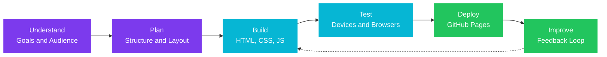
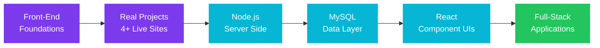

<div align="center">

<!-- ============================================================ -->
<!--                          HERO SECTION                         -->
<!-- ============================================================ -->

<br>

# Sk Kutubuddin

### Front-End Web Developer &nbsp;|&nbsp; Final-Year Diploma Student (2024 to 2027)

<br>

**I build fast, responsive and visually polished websites for businesses, restaurants and brands.**
<br>
Graduating in 2027 and open to internships, junior roles and freelance projects.

<br>

[](https://git.io/typing-svg)

<br>

[](https://sweetkutub-svg.github.io/My_Portfolio/)
[](https://www.linkedin.com/in/sk-kutubuddin-6377a1391/)
[](mailto:codewithkutub@gmail.com)
[](#-availability-and-work-preferences)

<br>


<br>

</div>

---

## Table of Contents

- [Professional Summary](#-professional-summary)
- [Why Work With Me](#-why-work-with-me)
- [At a Glance](#-at-a-glance)
- [Core Competencies](#-core-competencies)
- [Tech Stack](#-tech-stack)
- [Featured Projects](#-featured-projects)
- [Project Case Studies](#-project-case-studies)
- [Final-Year Project](#-final-year-project)
- [How I Work](#-how-i-work)
- [Code Quality Standards](#-code-quality-standards)
- [Skills Matrix](#-skills-matrix)
- [Continuous Learning](#-continuous-learning)
- [Career Objective](#-career-objective)
- [Services](#-services)
- [Availability and Work Preferences](#-availability-and-work-preferences)
- [Education](#-education)
- [Frequently Asked Questions](#-frequently-asked-questions)
- [Contact](#-contact)

---

## 👤 Professional Summary

I am a final-year diploma student (2024 to 2027) and front-end web developer
based in Kolkata, India. Over the course of my studies I have designed, built and
deployed **more than four live websites**, including a luxury e-commerce store and
multiple fine-dining restaurant sites, all hosted publicly so anyone can review
the work.

My focus is on turning a business goal into a clean, fast and responsive website.
I work primarily with **HTML5, CSS3, JavaScript and Bootstrap 5**, use **Git and
GitHub** for version control and deployment, and use **Python** for scripting and
automation. I am now extending my skills toward full-stack development with
**Node.js, MySQL and React**.

I am looking for an opportunity, whether an internship, a junior developer role or
a freelance engagement, where I can contribute from day one and keep growing
alongside an experienced team.

> *"Code is not just instructions for machines. It is creative expression turned into something real."*

<br>

---

## ⭐ Why Work With Me

<div align="center">

| | Strength | What It Means for You |
|:---:|:---|:---|
| 🚀 | **I ship real, live work** | Every project below is deployed and publicly viewable, not a tutorial clone stuck on my laptop. |
| 📱 | **Responsive by default** | Sites are built to work cleanly on phones, tablets and desktops. |
| 🎨 | **Design sensibility** | I care about spacing, typography and visual hierarchy, so the result looks professional. |
| 🧱 | **Clean, maintainable code** | Organized structure, meaningful naming and consistent styling that others can pick up easily. |
| 📈 | **Fast learner** | I moved from static pages to interactive e-commerce features and am now learning backend and React. |
| 🤝 | **Reliable communication** | Clear updates, honest timelines and quick responses. |
| 🌍 | **Business-minded** | I build with the customer journey in mind: menus, reservations, catalogs, reviews and conversions. |

</div>

<br>

---

## ⚡ At a Glance

<div align="center">

| | |
|:---|:---|
| 🎓 **Education** | Diploma program, 2024 to 2027 (final year) |
| 📍 **Location** | Kolkata, West Bengal, India |
| 💼 **Role Focus** | Front-End Web Developer, Junior Full-Stack (in progress) |
| 🚀 **Delivered** | 4+ live websites across e-commerce, hospitality and portfolio |
| 🛠 **Core Skills** | HTML5, CSS3, JavaScript, Bootstrap 5, Python, Git |
| 🌱 **Learning Now** | Node.js, MySQL, React |
| 🗣 **Languages** | English, Hindi, Bengali <!-- edit to match your languages --> |
| 📬 **Email** | codewithkutub@gmail.com |
| 🟢 **Availability** | Open to internships, junior roles and freelance work |

</div>

<br>

---

## 🧩 Core Competencies

<table>
<tr>
<td width="50%" valign="top">

### Front-End Development

- Semantic, accessible HTML5 markup
- Modern CSS: Flexbox, Grid, custom properties, transitions
- Responsive, mobile-first layouts
- Vanilla JavaScript for interactive UI
- Bootstrap 5 components and utilities
- Cross-browser and cross-device testing

</td>
<td width="50%" valign="top">

### UI and Experience Design

- Visual hierarchy and consistent design systems
- Typography, color and spacing decisions
- Micro-interactions and scroll animations
- Conversion-focused sections (menus, reviews, CTAs)
- Clean navigation and page structure
- Attention to detail and polish

</td>
</tr>
<tr>
<td width="50%" valign="top">

### Programming and Automation

- Python scripting and task automation
- Voice-driven assistant experimentation (Jarvis)
- C programming fundamentals
- Problem-solving and logic building
- Command-line basics on Linux

</td>
<td width="50%" valign="top">

### Workflow and Deployment

- Git version control with clear commit messages
- GitHub repositories and project organization
- Deployment with GitHub Pages
- Debugging with browser developer tools
- Iterating on feedback

</td>
</tr>
</table>

<br>

---

## 🛠 Tech Stack

<div align="center">

### Front-End


### Programming Languages


### Tools and Platforms


### Currently Learning


</div>

<br>

---

## 🚀 Featured Projects

<div align="center">

| Project | Industry | What It Demonstrates | Tech | Live |
|:---|:---:|:---|:---|:---:|
| 🛍️ **MAISON Store** | E-Commerce | Product catalog, shopping bag, wishlist, size guide | HTML, CSS, JS | [View Live](https://sweetkutub-svg.github.io/maison-store_E-Commarce/) |
| 🍽️ **Mondol Restaurant** | Hospitality | Menu, chef profile, gallery, reservations | HTML, CSS, JS | [View Live](https://sweetkutub-svg.github.io/MondolRestaurant/) |
| 🍛 **Rao's Restaurant** | Hospitality | Animated counters, full menu, customer reviews | HTML, CSS, JS | [View Live](https://sweetkutub-svg.github.io/Rao-s-Resturent/) |
| 🌶️ **Imli Mix** | Creative | Creative UI/UX, first project, strong foundations | HTML, CSS | [View Live](https://sweetkutub-svg.github.io/Imli_mix/) |

</div>

<br>

### Pinned Repositories

<div align="center">

[](https://github.com/sweetkutub-svg/My_Portfolio)
[](https://github.com/sweetkutub-svg/Jarvis_voice)

</div>

<br>

---

## 🔍 Project Case Studies

Each case study follows the same structure: the challenge, my approach, the
features I delivered, and the skills it demonstrates.

<details>
<summary><b>🛍️ MAISON Store: Luxury Fashion E-Commerce</b></summary>

<br>

| | |
|:---|:---|
| **Type** | E-commerce front-end |
| **Role** | Sole designer and developer |
| **Stack** | HTML5, CSS3, JavaScript |
| **Live** | [sweetkutub-svg.github.io/maison-store_E-Commarce](https://sweetkutub-svg.github.io/maison-store_E-Commarce/) |

**The Challenge**
Luxury shoppers expect an experience that feels as refined as the products.
The goal was to deliver a premium look and a smooth shopping flow without
relying on a heavy framework.

**My Approach**
- Planned the page structure and shopping flow before writing code
- Built a consistent visual identity with elegant typography and restrained color
- Implemented the bag and wishlist logic in vanilla JavaScript
- Tested the layout across multiple screen sizes

**What I Delivered**
- Browsable product catalog
- Shopping bag with item management
- Wishlist for saving favorite products
- Size guide to reduce purchase hesitation
- Fully responsive layout

**Skills Demonstrated**
`State management in JS` &nbsp; `Responsive design` &nbsp; `Design consistency` &nbsp; `User flow thinking`

<br>

</details>

<details>
<summary><b>🍽️ Mondol Restaurant: Fine-Dining Website</b></summary>

<br>

| | |
|:---|:---|
| **Type** | Restaurant website |
| **Role** | Sole designer and developer |
| **Stack** | HTML5, CSS3, JavaScript |
| **Live** | [sweetkutub-svg.github.io/MondolRestaurant](https://sweetkutub-svg.github.io/MondolRestaurant/) |

**The Challenge**
A fine-dining restaurant needs to convey atmosphere and quality online, and make
it easy for a visitor to go from browsing to booking a table.

**My Approach**
- Prioritized the visitor journey: story, menu, gallery, then reservation
- Used strong imagery and whitespace to create an upscale feel
- Kept the reservation experience short and simple

**What I Delivered**
- Categorized menu with clear descriptions
- Chef profile that adds a personal story
- Gallery showcasing food and ambience
- Reservation section
- Responsive layout for every device

**Skills Demonstrated**
`Visual hierarchy` &nbsp; `Image galleries` &nbsp; `Form design` &nbsp; `Content-heavy layouts`

<br>

</details>

<details>
<summary><b>🍛 Rao's Restaurant: Premium Indian Dining</b></summary>

<br>

| | |
|:---|:---|
| **Type** | Restaurant website |
| **Role** | Sole designer and developer |
| **Stack** | HTML5, CSS3, JavaScript |
| **Live** | [sweetkutub-svg.github.io/Rao-s-Resturent](https://sweetkutub-svg.github.io/Rao-s-Resturent/) |

**The Challenge**
Make an Indian dining brand feel premium and trustworthy, with more energy and
motion than a static brochure site.

**My Approach**
- Added purposeful animation to highlight key numbers and sections
- Used customer reviews as social proof to build trust
- Kept animations lightweight so pages stay fast

**What I Delivered**
- Animated counters for key business figures
- Complete menu presentation
- Customer reviews section
- Polished hover and scroll interactions
- Responsive layout

**Skills Demonstrated**
`JavaScript animation` &nbsp; `Social proof design` &nbsp; `Performance awareness` &nbsp; `Polish and detail`

<br>

</details>

<details>
<summary><b>🌶️ Imli Mix: Where It Started</b></summary>

<br>

| | |
|:---|:---|
| **Type** | Creative web project |
| **Role** | Sole designer and developer |
| **Stack** | HTML5, CSS3 |
| **Live** | [sweetkutub-svg.github.io/Imli_mix](https://sweetkutub-svg.github.io/Imli_mix/) |

**The Challenge**
Learn the fundamentals of web development by building something with personality.

**What I Delivered**
- A creative, playful interface
- A memorable user experience
- A clean foundation of HTML and CSS that I built on in every later project

**Skills Demonstrated**
`HTML and CSS fundamentals` &nbsp; `Creative UI thinking` &nbsp; `First deployment on GitHub Pages`

<br>

</details>

<details>
<summary><b>🐍 Jarvis Voice: Python Voice Assistant</b></summary>

<br>

| | |
|:---|:---|
| **Type** | Python automation project |
| **Role** | Sole developer |
| **Stack** | Python |
| **Repo** | [github.com/sweetkutub-svg/Jarvis_voice](https://github.com/sweetkutub-svg/Jarvis_voice) |

**The Challenge**
Explore how software can be controlled naturally by voice and automate everyday
tasks.

**What I Delivered**
- A voice-driven assistant built in Python
- A modular structure that can grow feature by feature

**Skills Demonstrated**
`Python scripting` &nbsp; `Working with libraries` &nbsp; `Automation thinking` &nbsp; `Modular design`

<br>

</details>

<br>

---

## 🎓 Final-Year Project

<!--
  EDIT THIS SECTION: Replace the placeholder text below with details of your
  real final-year diploma project. Recruiters value this section highly.
-->

<div align="center">

| | |
|:---|:---|
| **Project Title** | *Add your final-year project title here* |
| **Problem Solved** | *One sentence describing the real problem it addresses* |
| **Technologies** | *List the technologies you used* |
| **Your Role** | *Your responsibilities (and team size, if any)* |
| **Outcome** | *What you achieved: features delivered, results, or feedback received* |
| **Link** | *Repository or live demo link* |

</div>

> Tip: A clear final-year project with a real problem statement and a live demo
> is one of the strongest things you can show a recruiter. Fill this in before
> you publish.

<br>

---

## 🔄 How I Work



<div align="center">

| Phase | What I Do | What You Get |
|:---|:---|:---|
| **1. Discover** | Clarify goals, audience, content and references | A shared understanding before any code is written |
| **2. Plan** | Define sections, navigation and visual direction | A clear structure and layout |
| **3. Build** | Write semantic HTML, styled CSS and focused JavaScript | A working, responsive website |
| **4. Test** | Check multiple screen sizes and browsers, fix issues | A reliable experience for every visitor |
| **5. Deploy** | Publish the site with clean version history | A live link you can share immediately |
| **6. Iterate** | Apply feedback and refine details | A site that keeps improving |

</div>

<br>

---

## 📐 Code Quality Standards

<div align="center">

| Standard | How I Apply It |
|:---|:---|
| **Readability** | Clear naming, consistent formatting and small focused functions |
| **Responsiveness** | Mobile-first layouts tested on multiple screen sizes |
| **Performance** | Optimized images, minimal scripts and lightweight animation |
| **Accessibility** | Semantic HTML, alt text and readable color contrast |
| **Consistency** | Shared design tokens for color, spacing and typography |
| **Version control** | Frequent commits with descriptive messages |
| **Maintainability** | Organized folders and reusable patterns |

</div>

<br>

### Style Snapshot

```css
/* Design tokens keep the whole site visually consistent */
:root {
  --color-primary: #7c3aed;
  --color-accent: #06b6d4;
  --color-bg: #0d0d1a;
  --color-text: #e2e8f0;
  --radius: 10px;
  --space: 1rem;
}

.card {
  padding: calc(var(--space) * 1.5);
  border-radius: var(--radius);
  background: var(--color-bg);
  color: var(--color-text);
  transition: transform 0.25s ease, box-shadow 0.25s ease;
}

.card:hover {
  transform: translateY(-4px);
  box-shadow: 0 12px 24px rgba(124, 58, 237, 0.25);
}
```

```javascript
// Small, focused, reusable functions
function animateCounter(element, target, duration = 1500) {
  const start = performance.now();

  function update(now) {
    const progress = Math.min((now - start) / duration, 1);
    element.textContent = Math.floor(progress * target);
    if (progress < 1) requestAnimationFrame(update);
  }

  requestAnimationFrame(update);
}
```

<br>

---

## 📊 Skills Matrix

<div align="center">

| Category | Technology | Level | Evidence |
|:---|:---|:---:|:---|
| Markup | HTML5 | ⭐⭐⭐⭐☆ | Used in all 4+ live projects |
| Styling | CSS3 | ⭐⭐⭐⭐☆ | Responsive layouts, animations, design tokens |
| Scripting | JavaScript | ⭐⭐⭐☆☆ | Bag, wishlist and animated counters |
| Framework | Bootstrap 5 | ⭐⭐⭐⭐☆ | Grid and component-based layouts |
| Language | Python | ⭐⭐⭐☆☆ | Jarvis voice assistant |
| Language | C | ⭐⭐⭐☆☆ | Academic coursework |
| Version Control | Git and GitHub | ⭐⭐⭐☆☆ | All projects versioned and deployed |
| Deployment | GitHub Pages | ⭐⭐⭐⭐☆ | Every project is live |
| Environment | Linux | ⭐⭐☆☆☆ | Command-line basics |
| Backend | Node.js | ⭐☆☆☆☆ | Currently learning |
| Database | MySQL | ⭐☆☆☆☆ | Currently learning |
| Library | React | ⭐☆☆☆☆ | Currently learning |

</div>

<br>

---

## 🌱 Continuous Learning

I am deliberately growing from front-end into full-stack development.



<div align="center">

| Technology | Purpose | Target Outcome |
|:---|:---|:---|
| **Node.js** | Server-side logic and APIs | A working backend for one of my projects |
| **MySQL** | Persistent data storage | A properly designed database schema |
| **React** | Scalable component-based interfaces | An existing project rebuilt in React |
| **Advanced Git** | Professional collaboration | Confident use of branches and pull requests |

</div>

<br>

---

## 🎯 Career Objective

> To join a development team as an intern or junior developer, where I can apply
> my front-end skills to real products, learn from experienced engineers, and grow
> into a well-rounded full-stack developer.

<details open>
<summary><b>Roles I am targeting</b></summary>

<br>

- Front-End Developer (Intern or Junior)
- Web Developer (Intern or Junior)
- UI Developer
- Junior Full-Stack Developer (as my backend skills mature)
- Freelance Website Developer

</details>

<details>
<summary><b>Goals</b></summary>

<br>

**Next 6 months**

- [x] Build and deploy four live website projects
- [x] Publish a personal portfolio
- [ ] Complete and document my final-year project
- [ ] Build a project connected to a MySQL database
- [ ] Rebuild one project using React
- [ ] Secure an internship or first junior role

**Next 1 to 2 years**

- [ ] Ship a complete full-stack application
- [ ] Contribute to an open-source project
- [ ] Strengthen data structures and algorithms
- [ ] Grow into a confident full-stack developer

</details>

<br>

---

## 💼 Services

<div align="center">

| Service | Best For | Deliverable |
|:---|:---|:---|
| 🌐 **Business Websites** | Small businesses and local brands | Multi-section, responsive site |
| 🍽️ **Restaurant and Cafe Sites** | Hospitality businesses | Menu, gallery, reviews, reservations |
| 🛍️ **E-Commerce Front-Ends** | Online stores and boutiques | Catalog, cart and wishlist interface |
| 👤 **Personal Portfolios** | Students and professionals | Modern, fast portfolio website |
| 📱 **Responsive Redesign** | Sites that break on mobile | Cleaned-up layout across all devices |
| ⚙️ **Python Automation** | Repetitive manual tasks | Custom script that saves time |

</div>

<br>

---

## 📅 Availability and Work Preferences

<div align="center">

| | |
|:---|:---|
| 🟢 **Status** | Open to work |
| 💼 **Engagement Types** | Internship, junior full-time, part-time, freelance |
| 🌐 **Work Mode** | Remote, hybrid or on-site in Kolkata |
| 📆 **Start Date** | Available for internships now, full-time after graduation (2027) |
| ⏱ **Response Time** | Usually within 24 hours |
| 📬 **Best Way to Reach Me** | Email or LinkedIn |

</div>

<br>

---

## 🎓 Education

<div align="center">

| | |
|:---|:---|
| **Program** | Diploma (3-year program) <!-- add your branch, e.g. Computer Science / IT --> |
| **Duration** | 2024 to 2027 |
| **Current Status** | Final year |
| **Institution** | *Add your institute name here* |
| **Relevant Coursework** | Programming in C, Web Technologies, Databases <!-- edit to match your syllabus --> |

</div>

<br>

---

## ❓ Frequently Asked Questions

<details>
<summary><b>Are you available for internships and full-time roles?</b></summary>

<br>

Yes. I am available for internships now and looking for junior roles that begin
around my graduation in 2027. I am also open to part-time and freelance work
alongside my studies.

</details>

<details>
<summary><b>What kind of work do you do best?</b></summary>

<br>

Front-end development: turning a design or an idea into a clean, responsive and
polished website using HTML, CSS, JavaScript and Bootstrap.

</details>

<details>
<summary><b>Can you work with backend technologies?</b></summary>

<br>

I am currently learning Node.js and MySQL and building toward full-stack skills.
I am upfront about my level, and I learn quickly when a project needs something
new.

</details>

<details>
<summary><b>How do I see examples of your work?</b></summary>

<br>

Every project in the [Featured Projects](#-featured-projects) section has a live
link, and my [portfolio](https://sweetkutub-svg.github.io/My_Portfolio/) brings
them together in one place.

</details>

<details>
<summary><b>What is the best way to contact you?</b></summary>

<br>

Email me at **codewithkutub@gmail.com** or message me on
[LinkedIn](https://www.linkedin.com/in/sk-kutubuddin-6377a1391/).

</details>

<br>

---

## 📬 Contact

<div align="center">

**Have a role, project or idea in mind? Let's talk.**

<br>

[](https://github.com/sweetkutub-svg)
[](https://www.linkedin.com/in/sk-kutubuddin-6377a1391/)
[](https://sweetkutub-svg.github.io/My_Portfolio/)
[](mailto:codewithkutub@gmail.com)

</div>

<br>

---

<div align="center">

### Thank you for visiting my profile ⭐

*If you like my work, a star on any repository means a lot.*

<br>


<br>

**Designed and built by Sk Kutubuddin &nbsp;|&nbsp; Kolkata, India**

</div>
