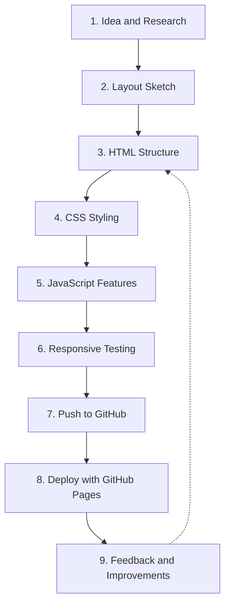

<div align="center">

<!-- ============================================================ -->
<!--                          HERO SECTION                         -->
<!-- ============================================================ -->

<br>

# Sk Kutubuddin

### Web Developer &nbsp;|&nbsp; Creative Coder &nbsp;|&nbsp; Diploma Engineering Student

<br>

*Building clean, responsive and user-focused websites, one project at a time.*

<br>

[](https://git.io/typing-svg)

<br>

[](https://sweetkutub-svg.github.io/My_Portfolio/)
[](https://www.linkedin.com/in/sk-kutubuddin-6377a1391/)
[](mailto:codewithkutub@gmail.com)
[](#-lets-work-together)

<br>


<br>

</div>

---

## Table of Contents

- [About Me](#-about-me)
- [Quick Facts](#-quick-facts)
- [Tech Stack](#-tech-stack)
- [Skill Overview](#-skill-overview)
- [Featured Projects](#-featured-projects)
- [Project Deep Dive](#-project-deep-dive)
- [What I Am Learning](#-what-i-am-learning)
- [Learning Roadmap](#-learning-roadmap)
- [Development Workflow](#-development-workflow)
- [Engineering Principles](#-engineering-principles)
- [Services I Offer](#-services-i-offer)
- [Currently Working On](#-currently-working-on)
- [Goals](#-goals)
- [Frequently Asked Questions](#-frequently-asked-questions)
- [Lets Work Together](#-lets-work-together)
- [Connect With Me](#-connect-with-me)

---

## 👤 About Me

I am a diploma student in a three-year program (2024 to 2027), currently in my
second year. I enjoy turning ideas into fast, clean and responsive websites, and
I care about the small details that make a site feel polished: spacing,
typography, smooth interactions and clear structure.

Alongside web development, I work with Python for scripting and automation, and I
like experimenting with side projects such as a voice assistant called Jarvis.
Every project is a chance to learn something new and to ship something real.

> *"Code is not just instructions for machines. It is creative expression turned into something real."*

<br>

## ⚡ Quick Facts

<div align="center">

| | |
|:---|:---|
| 🎓 **Education** | Diploma Program, 2024 to 2027 (currently 2nd year) |
| 📍 **Location** | Kolkata, West Bengal, India |
| 💼 **Focus** | Front-end web development, responsive design |
| 🐍 **Also into** | Python scripting, automation, voice assistants |
| 🚀 **Projects built** | 4+ live websites |
| 🌱 **Learning** | Node.js, MySQL, React |
| 📬 **Email** | codewithkutub@gmail.com |
| ☕ **Fuel** | Chai, especially during late-night coding sessions |

</div>

<br>

---

## 🛠 Tech Stack

<div align="center">

### Front-End


### Programming Languages


### Tools and Platforms


### Currently Learning


</div>

<br>

---

## 📊 Skill Overview

A self-assessment of where I stand today. This is honest, not inflated, and it
updates as I grow.

<div align="center">

| Area | Technology | Comfort Level | Notes |
|:---|:---|:---:|:---|
| Markup | HTML5 | ⭐⭐⭐⭐☆ | Semantic structure, accessibility basics |
| Styling | CSS3 | ⭐⭐⭐⭐☆ | Flexbox, Grid, animations, responsive layouts |
| Scripting | JavaScript | ⭐⭐⭐☆☆ | DOM manipulation, events, UI interactivity |
| Framework | Bootstrap 5 | ⭐⭐⭐⭐☆ | Grid system, components, utilities |
| Language | Python | ⭐⭐⭐☆☆ | Scripting, automation, voice assistant |
| Language | C | ⭐⭐⭐☆☆ | Fundamentals, problem solving |
| Version Control | Git and GitHub | ⭐⭐⭐☆☆ | Commits, branches, GitHub Pages hosting |
| Environment | Linux | ⭐⭐☆☆☆ | Command-line basics |
| Backend | Node.js | ⭐☆☆☆☆ | Just getting started |
| Database | MySQL | ⭐☆☆☆☆ | Learning queries and schema design |
| Library | React | ⭐☆☆☆☆ | Learning components and state |

</div>

<br>

---

## 🚀 Featured Projects

<div align="center">

| Project | Description | Tech | Live Demo |
|:---|:---|:---|:---:|
| 🛍️ **MAISON Store** | Luxury fashion e-commerce with catalog, shopping bag, wishlist and size guide | HTML, CSS, JS | [View Live](https://sweetkutub-svg.github.io/maison-store_E-Commarce/) |
| 🍽️ **Mondol Restaurant** | Fine-dining website with menu, chef profile, gallery and reservations | HTML, CSS, JS | [View Live](https://sweetkutub-svg.github.io/MondolRestaurant/) |
| 🍛 **Rao's Restaurant** | Premium Indian dining site with animated counters, full menu and reviews | HTML, CSS, JS | [View Live](https://sweetkutub-svg.github.io/Rao-s-Resturent/) |
| 🌶️ **Imli Mix** | My first web project, focused on creative UI/UX and a memorable experience | HTML, CSS | [View Live](https://sweetkutub-svg.github.io/Imli_mix/) |

</div>

<br>

### Pinned Repositories

<div align="center">

[](https://github.com/sweetkutub-svg/My_Portfolio)
[](https://github.com/sweetkutub-svg/Jarvis_voice)

</div>

<br>

---

## 🔍 Project Deep Dive

Expand any project below to see what it includes and what I learned building it.

<details>
<summary><b>🛍️ MAISON Store: Luxury Fashion E-Commerce</b></summary>

<br>

**Overview**
A front-end e-commerce experience for a luxury fashion brand. The goal was to
recreate the feel of a premium online boutique, with a clean layout, elegant
typography and a smooth shopping flow.

**Key Features**

- Product catalog with a clear, browsable layout
- Shopping bag with item management
- Wishlist to save favorite products
- Size guide to help customers choose confidently
- Responsive design across mobile, tablet and desktop

**What I Practiced**

- Structuring a multi-section site with reusable components
- Managing UI state with JavaScript (bag and wishlist)
- Designing a consistent visual identity with CSS
- Making layouts adapt cleanly to different screen sizes

**Links**

- Live: [sweetkutub-svg.github.io/maison-store_E-Commarce](https://sweetkutub-svg.github.io/maison-store_E-Commarce/)

<br>

</details>

<details>
<summary><b>🍽️ Mondol Restaurant: Fine-Dining Website</b></summary>

<br>

**Overview**
A sophisticated restaurant website designed to present the dining experience
before a guest ever walks through the door.

**Key Features**

- Categorized menu with clear item descriptions
- Chef profile section that adds a personal touch
- Photo gallery showcasing the food and ambience
- Reservation section for booking a table
- Fully responsive layout

**What I Practiced**

- Building visual hierarchy for content-heavy pages
- Creating image galleries that stay tidy on every screen
- Designing forms that are simple and easy to complete
- Balancing elegance with readability

**Links**

- Live: [sweetkutub-svg.github.io/MondolRestaurant](https://sweetkutub-svg.github.io/MondolRestaurant/)

<br>

</details>

<details>
<summary><b>🍛 Rao's Restaurant: Premium Indian Dining</b></summary>

<br>

**Overview**
A premium website for an Indian dining brand, with more motion and personality
than my earlier projects.

**Key Features**

- Animated counters highlighting key numbers
- Complete menu presentation
- Customer reviews section to build trust
- Polished scroll and hover interactions
- Responsive across devices

**What I Practiced**

- Writing JavaScript animations, such as counters triggered on scroll
- Presenting social proof (reviews) in a clean way
- Keeping animations smooth without hurting performance
- Improving visual polish through spacing and typography

**Links**

- Live: [sweetkutub-svg.github.io/Rao-s-Resturent](https://sweetkutub-svg.github.io/Rao-s-Resturent/)

<br>

</details>

<details>
<summary><b>🌶️ Imli Mix: My First Web Project</b></summary>

<br>

**Overview**
This is where it all started. Imli Mix was my first real web project, built to
learn the fundamentals and to experiment with creative UI/UX ideas.

**Key Features**

- Creative, playful visual design
- Focus on a memorable user experience
- Clean HTML and CSS foundations

**What I Practiced**

- Core HTML structure and CSS styling
- Publishing a site with GitHub Pages for the first time
- Turning a rough idea into something people can actually visit

**Links**

- Live: [sweetkutub-svg.github.io/Imli_mix](https://sweetkutub-svg.github.io/Imli_mix/)

<br>

</details>

<details>
<summary><b>🐍 Jarvis Voice: Python Voice Assistant</b></summary>

<br>

**Overview**
A personal experiment in building a voice-driven assistant with Python,
inspired by the idea of a helpful AI companion.

**Focus Areas**

- Voice input and spoken responses
- Automating everyday tasks with Python scripts
- Structuring a project that can grow feature by feature

**What I Practiced**

- Writing modular Python code
- Working with external libraries
- Thinking about how people interact with software by voice

**Links**

- Repository: [github.com/sweetkutub-svg/Jarvis_voice](https://github.com/sweetkutub-svg/Jarvis_voice)

<br>

</details>

<br>

---

## 🌱 What I Am Learning

I believe a developer should always have something they are learning. Right now
my attention is on moving from front-end only to full-stack development.

<div align="center">

| Technology | Why I Am Learning It | Goal |
|:---|:---|:---|
| **Node.js** | To build server-side logic and APIs | Create my own backend for a project |
| **MySQL** | To store and query real application data | Design a proper database schema |
| **React** | To build scalable, component-based interfaces | Rebuild a portfolio project in React |
| **Git workflows** | To collaborate and manage code professionally | Use branches and pull requests confidently |

</div>

<br>

---

## 🗺 Learning Roadmap

```mermaid
flowchart LR
    A["HTML and CSS<br/>Foundations"] --> B["JavaScript<br/>Interactivity"]
    B --> C["Bootstrap 5<br/>Responsive UI"]
    C --> D["Real Projects<br/>MAISON, Mondol, Rao's"]
    D --> E["Node.js<br/>Backend"]
    E --> F["MySQL<br/>Databases"]
    F --> G["React<br/>Modern Front-End"]
    G --> H["Full-Stack<br/>Applications"]

    style A fill:#7C3AED,stroke:#7C3AED,color:#fff
    style B fill:#7C3AED,stroke:#7C3AED,color:#fff
    style C fill:#7C3AED,stroke:#7C3AED,color:#fff
    style D fill:#7C3AED,stroke:#7C3AED,color:#fff
    style E fill:#06B6D4,stroke:#06B6D4,color:#fff
    style F fill:#06B6D4,stroke:#06B6D4,color:#fff
    style G fill:#06B6D4,stroke:#06B6D4,color:#fff
    style H fill:#22C55E,stroke:#22C55E,color:#fff
```



<div align="center">

🟣 Completed &nbsp;&nbsp; 🔵 In progress &nbsp;&nbsp; 🟢 Destination

</div>

<br>

---

## 🔄 Development Workflow

This is how I usually take a project from idea to live website.



<details>
<summary><b>Step-by-step breakdown</b></summary>

<br>

| Step | What Happens |
|:---:|:---|
| 1 | Understand the goal, audience and content. Look at similar websites for inspiration. |
| 2 | Sketch the page layout and decide the sections and their order. |
| 3 | Write clean, semantic HTML that gives the page a solid skeleton. |
| 4 | Apply CSS for colors, typography, spacing and layout. |
| 5 | Add JavaScript for interactions such as menus, sliders, counters and forms. |
| 6 | Test on multiple screen sizes and fix anything that breaks. |
| 7 | Commit changes with clear messages and push them to GitHub. |
| 8 | Publish the site with GitHub Pages. |
| 9 | Collect feedback, refine details and iterate. |

</details>

<br>

---

## 📐 Engineering Principles

The habits I try to follow in every project:

<div align="center">

| Principle | What It Means to Me |
|:---|:---|
| **Clarity first** | Readable code beats clever code. Future me should understand it. |
| **Mobile-friendly by default** | Every layout must work on a phone, not only on a desktop. |
| **Performance matters** | Optimize images, avoid unnecessary scripts and keep pages fast. |
| **Consistency** | Reuse spacing, colors and components so the design feels unified. |
| **Accessibility basics** | Use semantic HTML, alt text and sufficient color contrast. |
| **Ship, then improve** | A live project teaches more than a perfect unfinished one. |
| **Keep learning** | Technology moves fast. Curiosity is the real skill. |

</div>

<br>

### Code Style Snapshot

A small example of the kind of clean, readable code I aim to write:

```css
/* Design tokens keep the whole site consistent */
:root {
  --color-primary: #7c3aed;
  --color-accent: #06b6d4;
  --color-bg: #0d0d1a;
  --color-text: #e2e8f0;
  --radius: 10px;
  --space: 1rem;
}

.card {
  padding: calc(var(--space) * 1.5);
  border-radius: var(--radius);
  background: var(--color-bg);
  color: var(--color-text);
  transition: transform 0.25s ease, box-shadow 0.25s ease;
}

.card:hover {
  transform: translateY(-4px);
  box-shadow: 0 12px 24px rgba(124, 58, 237, 0.25);
}
```

```javascript
// Small, focused functions are easy to test and reuse
function animateCounter(element, target, duration = 1500) {
  const start = performance.now();

  function update(now) {
    const progress = Math.min((now - start) / duration, 1);
    element.textContent = Math.floor(progress * target);
    if (progress < 1) requestAnimationFrame(update);
  }

  requestAnimationFrame(update);
}
```

<br>

---

## 💼 Services I Offer

I am open to freelance work and internships. Here is what I can help with:

<div align="center">

| Service | Description |
|:---|:---|
| 🌐 **Business Websites** | Clean, professional websites for small businesses and local brands |
| 🍽️ **Restaurant and Cafe Sites** | Menu, gallery, reviews and reservation sections |
| 🛍️ **E-Commerce Front-Ends** | Product catalogs, cart and wishlist interfaces |
| 👤 **Personal Portfolios** | Modern portfolio sites for students and professionals |
| 📱 **Responsive Redesign** | Making existing sites look great on every device |
| ⚙️ **Python Automation** | Small scripts that save time on repetitive tasks |

</div>

<br>

### What You Can Expect From Me

- **Clear communication** and regular updates throughout the project
- **Clean, well-organized code** that is easy to maintain
- **Responsive layouts** tested on multiple screen sizes
- **Honest timelines** and no surprises
- **A willingness to learn** whatever the project requires

<br>

---

## 🔭 Currently Working On

<div align="center">

| Focus | Status |
|:---|:---:|
| Learning Node.js fundamentals | 🟡 In progress |
| Learning MySQL and database design | 🟡 In progress |
| Learning React basics | 🟡 In progress |
| Improving my portfolio website | 🟡 In progress |
| Expanding the Jarvis voice assistant | 🟡 In progress |
| Completing my diploma (2nd year) | 🟢 On track |

</div>

<br>

---

## 🎯 Goals

<details open>
<summary><b>Short-Term (next 6 months)</b></summary>

<br>

- [x] Build and publish four live website projects
- [x] Create a personal portfolio website
- [ ] Complete the Node.js fundamentals
- [ ] Build a project that connects to a MySQL database
- [ ] Rebuild one existing project using React
- [ ] Land a first internship or freelance client

</details>

<details>
<summary><b>Mid-Term (1 to 2 years)</b></summary>

<br>

- [ ] Build a complete full-stack application
- [ ] Contribute to an open-source project
- [ ] Strengthen my data structures and algorithms foundation
- [ ] Graduate with my diploma and continue into further studies or a developer role

</details>

<details>
<summary><b>Long-Term</b></summary>

<br>

- [ ] Become a confident full-stack developer
- [ ] Build products that real people use every day
- [ ] Mentor other beginners who are just starting out

</details>

<br>

---

## ❓ Frequently Asked Questions

<details>
<summary><b>Are you available for freelance work?</b></summary>

<br>

Yes. I am open to freelance projects, especially business websites, restaurant
sites, portfolios and e-commerce front-ends. Send me an email with a short
description of what you need.

</details>

<details>
<summary><b>Are you looking for an internship?</b></summary>

<br>

Yes. I am actively looking for web development internships where I can learn
from experienced developers while contributing to real projects.

</details>

<details>
<summary><b>What technologies do you work with most?</b></summary>

<br>

My strongest area is front-end development with HTML, CSS, JavaScript and
Bootstrap. I also use Python for scripting and automation, and I am currently
learning Node.js, MySQL and React.

</details>

<details>
<summary><b>How can I contact you?</b></summary>

<br>

The fastest way is email at **codewithkutub@gmail.com**. You can also reach me
on [LinkedIn](https://www.linkedin.com/in/sk-kutubuddin-6377a1391/).

</details>

<details>
<summary><b>Do you collaborate on open-source or side projects?</b></summary>

<br>

Absolutely. If you have a beginner-friendly project or an interesting idea,
feel free to reach out. Collaboration is one of the best ways to learn.

</details>

<br>

---

## 🤝 Let's Work Together

<div align="center">

If you have a project in mind, an opportunity to share, or just want to talk
about web development, I would love to hear from you.

<br>

[](mailto:codewithkutub@gmail.com)

<br>

</div>

<br>

---

## 🌐 Connect With Me

<div align="center">

[](https://github.com/sweetkutub-svg)
[](https://www.linkedin.com/in/sk-kutubuddin-6377a1391/)
[](https://sweetkutub-svg.github.io/My_Portfolio/)
[](mailto:codewithkutub@gmail.com)

</div>

<br>

---

<div align="center">

### Thanks for stopping by! ⭐

*If you like my work, consider giving a repository a star. It really motivates me to keep building.*

<br>


<br>

**Made with ☕ and curiosity in Kolkata, India**

</div>
